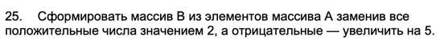
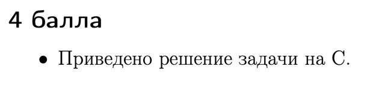
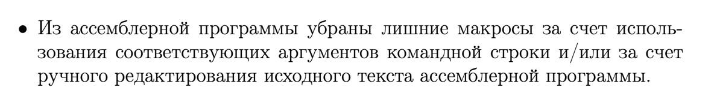
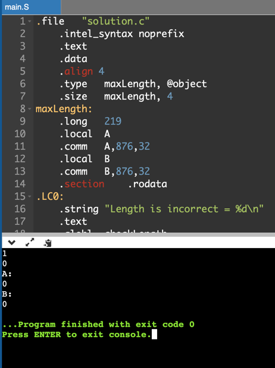

# ИДЗ №1 Андрей Гусев БПИ219

# Вариант #25



---
**Ограничения ввода:**

1) Массив А может содержать 1 <= len(A) <= 219 элементов.
2) Программа принимает на вход сначала длину массива А - число n, затем n чисел - элементы массива А.

---
###Критерий №4/10



- В проекте это файл `task.c`

---


- Компиляция без отладочных опций:

```gcc -O0 -masm=intel solution.c -S -o task_1.s```

- После компиляции создался файл `task_1.s`, комментарии написаны в нём

---



- Использованы аргументы командой строки и ручное редактирование, получился файл `task1.s`

---


- Программа скомпилирована и скомпонована без опций отладки

```gcc -masm=intel -fno-asynchronous-unwind-tables -fno-jump-tables -fno-stack-protector -fno-exceptions solution.c -S -o . solution_2.s```

---


**Тесты**

1) Ввод:

```
7
1 2 3 4 5 6 7
```

Предполагаемый вывод:

```
A: 
1 2 3 4 5 6 7 
B: 
2 2 2 2 2 2 2
```

Вывод программы на C:


Вывод программы на GAS:


---

2) Ввод:

```
0
```

Предполагаемый вывод:

```
Length is incorrect = 0
```

Вывод программы на C:


Вывод программы на GAS:


---

3) Ввод:

```
250
```

Предполагаемый вывод:

```
Length is incorrect = 250
```

Вывод программы на C:


Вывод программы на GAS:


---

4) Ввод:

```
10
-4 -1 -2 0 0 5 6 -7 -1 -5 
```

Предполагаемый вывод:

```
A: 
-4 -1 -2 0 0 5 6 -7 -1 -5 
B: 
1 4 3 0 0 2 2 -2 4 0 
```

Вывод программы на C:


Вывод программы на GAS:


---

5) Ввод:

```
100
39383 -19114 42777 -13085 -2207 -11665 35386 10492 -33351 -8579 -47638 40027 18690 -29941 47763 -36074 30540 33426 39172 5736 -44789 45368 -47433 6429 15782 -28470 -27138 15123 24067 -46865 -36071 29802 -15978 -26942 -16931 48167 11393 -31544 25011 28042 26229 27373 34421 -5081 -36216 48537 25198 44324 48315 14370 16413 -46474 26091 18980 9956 -8127 -43138 49170 -43004 47281 -47695 -29075 27084 -13673 10336 -23495 846 -28271 11313 -24143 -33876 3895 -30418 -49455 48814 -16633 -34566 40364 -5957 -36250 21087 -23192 -32724 -2822 45788 43584 -44597 -47349 42754 -37601 49932 45060 -324 43368 -2261 -39988 -13774 48586 -1906 47539 
```

Предполагаемый вывод:

```
A: 
39383 -19114 42777 -13085 -2207 -11665 35386 10492 -33351 -8579 -47638 40027 18690 -29941 47763 -36074 30540 33426 39172 5736 -44789 45368 -47433 6429 15782 -28470 -27138 15123 24067 -46865 -36071 29802 -15978 -26942 -16931 48167 11393 -31544 25011 28042 26229 27373 34421 -5081 -36216 48537 25198 44324 48315 14370 16413 -46474 26091 18980 9956 -8127 -43138 49170 -43004 47281 -47695 -29075 27084 -13673 10336 -23495 846 -28271 11313 -24143 -33876 3895 -30418 -49455 48814 -16633 -34566 40364 -5957 -36250 21087 -23192 -32724 -2822 45788 43584 -44597 -47349 42754 -37601 49932 45060 -324 43368 -2261 -39988 -13774 48586 -1906 47539 
B: 
2 -19109 2 -13080 -2202 -11660 2 2 -33346 -8574 -47633 2 2 -29936 2 -36069 2 2 2 2 -44784 2 -47428 2 2 -28465 -27133 2 2 -46860 -36066 2 -15973 -26937 -16926 2 2 -31539 2 2 2 2 2 -5076 -36211 2 2 2 2 2 2 -46469 2 2 2 -8122 -43133 2 -42999 2 -47690 -29070 2 -13668 2 -23490 2 -28266 2 -24138 -33871 2 -30413 -49450 2 -16628 -34561 2 -5952 -36245 2 -23187 -32719 -2817 2 2 -44592 -47344 2 -37596 2 2 -319 2 -2256 -39983 -13769 2 -1901 2
```
Вывод программы на C:


Вывод программы на GAS:


---

6) Ввод:

```
1
0
```

Предполагаемый вывод:

```
A: 
0 
B: 
0
```

Вывод программы на C:


Вывод программы на GAS:


---

---


- Сделал.

---

###Критерий №5/10


- Функции с передачей данных через параметры использованы (файл `task.c`)

```c
int checkLength(const int length) {
    if (length < 1 || length > maxLength) { 
        printf("Length is incorrect = %d\n", length);
        return 0;
    }
    return 1;
}

void readArray(const int size) {
    for (int i = 0; i < size; ++i) {
        scanf("%d", &A[i]); 
        B[i] = A[i];
    }
}

void calcArray(const int size) {
    for (int i = 0; i < size; ++i) {
        if (A[i] > 0)
            B[i] = 2;
        else if (A[i] < 0)
            B[i] = A[i] + 5;
    }
}
```

---


- Локальные переменные использованы

```c
int size; // (в main)
```

---


- В ассемблерную программу при вызове функции добавлены комментарии, описывающие передачу фактических параметров и
  перенос возвращаемого результата. Это можно увидеть в файле task1.s

---


- В функциях для формальных параметров добавлены комментарии, описывающие связь между параметрами языка Си и
  регистрами (стеком). Это можно увидеть в фале task1.s

---


- Информация добавлена в отчёт
